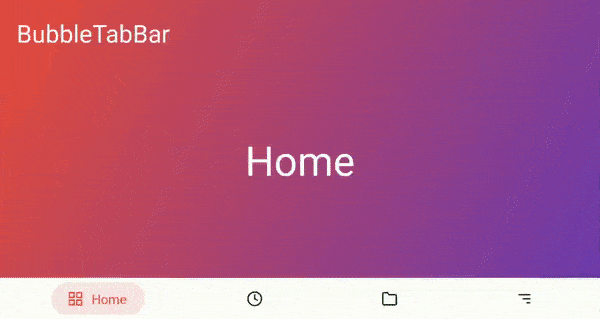

# BubbleTabBar

BubbleTabBar is bottom navigation bar with customizable bubble like tabs 



## Usage
 
```xml
    <com.fxn.BubbleTabBar
               android:id="@+id/bubbleTabBar"
               android:layout_width="match_parent"
               android:layout_height="wrap_content"
               android:background="#FFF"
               android:elevation="16dp"
               android:padding="7dp"
               app:bubbletab_menuResource="@menu/list"
               app:bubbletab_disabled_icon_color="@color/colorPrimaryDark"
               app:bubbletab_horizontal_padding="20dp"
               app:bubbletab_icon_size="20dp"
               app:bubbletab_title_size="16sp"
               app:bubbletab_vertical_padding="10dp">
       </com.fxn.BubbleTabBar>
```
or just use
```xml
    <com.fxn.BubbleTabBar
               android:id="@+id/bubbleTabBar"
               android:layout_width="match_parent"
               android:layout_height="wrap_content"
               android:padding="7dp"
               app:bubbletab_menuResource="@menu/list">
       </com.fxn.BubbleTabBar>
```
inflate menu list
```xml
<menu xmlns:android="http://schemas.android.com/apk/res/android">

    <item
            android:id="@+id/home"
            android:icon="@drawable/ic_grid"
            android:title="Home"
            android:checked="true"
            android:iconTint="@color/home"/>

    <item
            android:id="@+id/log"
            android:icon="@drawable/ic_clock"
            android:title="Logger"
            android:iconTint="@color/logger"/>
</menu>
            
```

add onclick listener 

```kotlin
   bubbleTabBar.addBubbLeListener(object : OnBubbleClickListener{
               override fun onBubbleClick(id: Int) {
                   
               }
           })
```

setup viewpager to BubbleTabBar

```kotlin

   bubbleTabBar.setupBubbleTabBar(viewpager)
   
```

## Credits
    thanks to [Ariana](https://github.com/akshay2211/Ariana) for transition in sample


## Download

[  ](https://bintray.com/fxn769/android_projects/BubbleTabBar/1.0.0/link)


 include in app level build.gradle
 ```groovy
        repositories {
           maven { url 'https://jitpack.io' }
        }
 ```
```groovy
        implementation  'com.fxn769:bubbletabbar:1.0.0'
```
or Maven:
```xml
        <dependency>
          <groupId>com.fxn769</groupId>
          <artifactId>bubbletabbar</artifactId>
          <version>1.0.0</version>
          <type>pom</type>
        </dependency>
```
or ivy:
```xml
        <dependency org='com.fxn769' name='bubbletabbar' rev='1.0.0'>
          <artifact name='bubbletabbar' ext='pom' ></artifact>
        </dependency>
```


## License
Licensed under the Apache License, Version 2.0, [click here for the full license](/LICENSE).

## Author & support
This project was created by [Akshay Sharma](https://akshay2211.github.io/).

> If you appreciate my work, consider buying me a cup of :coffee: to keep me recharged :metal: by [PayPal](https://www.paypal.me/akshay2211)

> I love using my work and I'm available for contract work. Freelancing helps to maintain and keep [my open source projects](https://github.com/akshay2211/) up to date!

